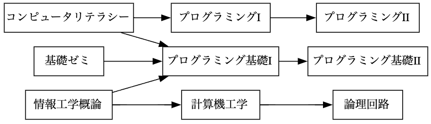
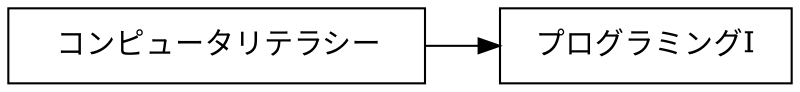
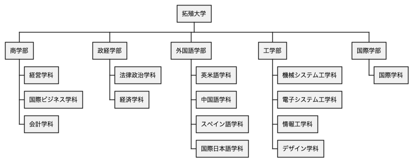
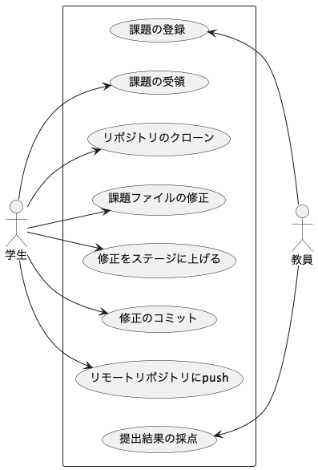

# 課題

## 課題 3.1 有向グラフ



プレビュー結果が上の図のようになるように，下記の記述を完成させよ．(接続関係が正しければ，上下が入れ替わっても構わない)

※ 日本語の文字列に対する箱の大きさが適切でない場合には，前後に空白を入れて調整せよ



## 課題 3.2 WBS



プレビュー結果が上の図のようになるように，下記の記述を完成させよ．(色や影などの違いは気にしなくてよい)

```plantUML
@startwbs ex02
* 拓殖大学
** 商学部
@endwbs
```

## 課題 3.3 ユースケース図



プレビュー結果が上の図のようになるように，下記の記述を完成させよ．ただし，別名については適当に設定してよい．(色や影などの違いは気にしなくてよい)

```plantUML
@startuml ex03
left to right direction
actor 学生 as student
rectangle {
    usecase "課題の受領" as uc2
}
student --> uc2
@enduml
```

## 課題 3.4 オリジナルの図解

「有向グラフ」「WBS」「ユースケース図」のどれかを使って，
独自の図解を作成せよ．対象は自由に決めてよいが，
誰かのコピーにならないように留意せよ．

```
```


## チェック
- [ ] 課題 3.1 有向グラフ
- [ ] 課題 3.2 WBS
- [ ] 課題 3.3 ユースケース図
- [ ] 課題 3.4 オリジナルの図解
