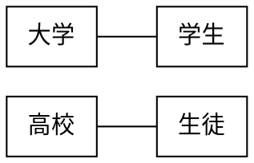
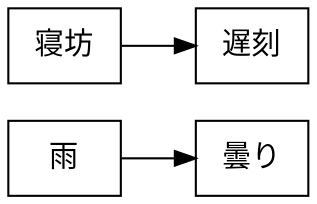
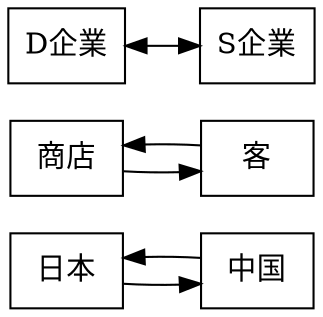
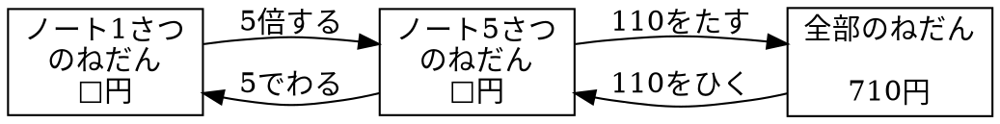

# 記述例

## Graphviz

### 図 3.1 無向グラフ



### 図 3.2 有向グラフ(単方向)



### 図 3.3 有向グラフ(双方向)



### 図 3.4 関係図



### 図 3.5 WBS

```plantUML
@startwbs uml01
* UML 2.0 
** 構造に関する表記
*** クラス図
*** オブジェクト図
*** パッケージ図
*** コンポジット構造図
*** コンポーネント図
*** 配置図
** 振舞いに関する表記
*** ユースケース図
*** アクティビティ図
*** 状態マシン図
*** シーケンス図
*** コミュニケーション図
*** 相互作用概要図
*** タイミング図
@endwbs
```

### 図 3.6 ユースケース図

```plantUML
@startuml usecase01
left to right direction
actor "学生" as student
actor "教員" as faculty
rectangle 履修管理システム {
    usecase "成績を確認する" as chkgrd
    usecase "成績を入力する" as setgrd
    usecase "時間割を確認する" as chktbl
    usecase "履修者名簿を取得する" as getlist
    usecase "履修登録をする" as regist
}
student --> regist
getlist <-- faculty
student --> chktbl
setgrd <-- faculty
student --> chkgrd
@enduml
```

### 図 3.7 WBS

```plantUML
@startwbs wbs01
* プレゼンテーション
** 準備
*** マインドマップ
*** 絵コンテ
*** 情報収集
** スライド作成
*** テキスト入力
*** 図表の挿入
*** レイアウト
** リハーサル
*** 時間の確認
*** スライドの修正
** 発表
*** 発表
*** 質疑応答
@endwbs
```
